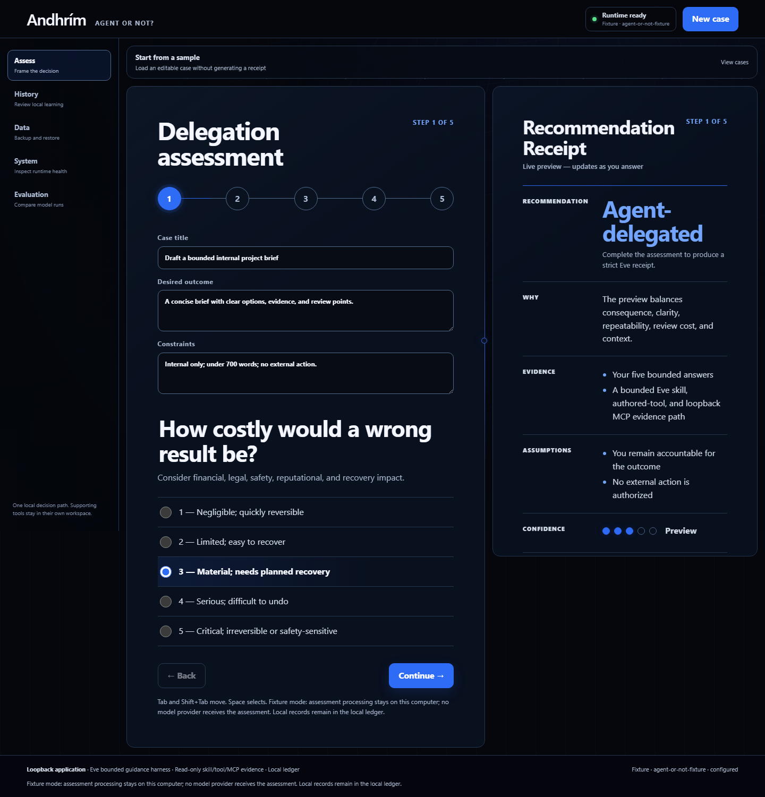
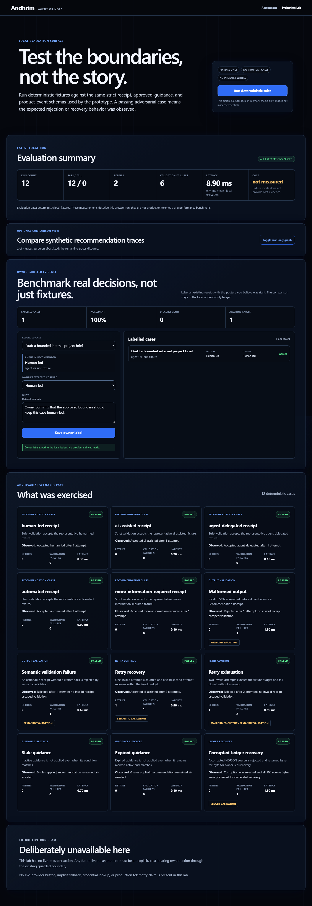
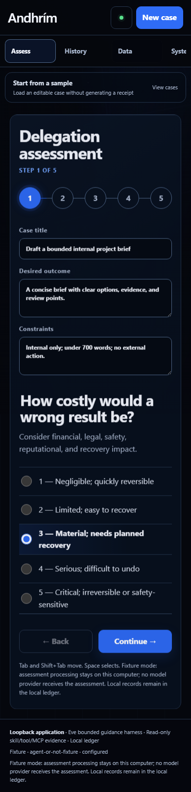

# Andhrím — Agent or Not?

Decide whether a piece of work should stay human-led, use AI assistance, be delegated to an agent, or be automated.

[Setup](docs/SETUP.md) · [How evidence works](docs/EVIDENCE_MODEL.md) · [Security](SECURITY.md) · [MIT licence](LICENSE)



Andhrím is a local, owner-controlled prototype. It turns five practical judgements into a readable Recommendation Receipt, then keeps outcomes and any resulting guidance reviewable by the owner.

## Features

- Five-factor assessment with sample cases and a live receipt preview.
- Responsive Recommendation Receipts with editable work plans and progressively disclosed trust evidence.
- Bounded Eve execution through one local skill, one read-only evidence tool, and one read-only MCP connection.
- Explicit owner approval before a Learning Candidate can influence another recommendation.
- Local history, learning lineage, export, print, backup, restore, expiry, and deletion controls.
- Provider-free evaluation fixtures plus an owner-labelled benchmark for real local cases.
- Guided OpenRouter setup with a no-inference key and model availability check.

## Interface tour

<p align="center">
  
  
</p>

## Quick start

Requires Windows 11, Node.js 24.17+, pnpm 11.18, Python 3.11–3.14, and [uv](https://docs.astral.sh/uv/). OpenRouter is optional; fixture mode works without a key.

```powershell
corepack pnpm install --frozen-lockfile
uv sync --project mcp_server --frozen
corepack pnpm build; corepack pnpm start
```

Open `http://127.0.0.1:3000`. See the [full Windows setup and troubleshooting guide](docs/SETUP.md) before running verification or enabling OpenRouter.

## How it works

The browser talks only to loopback Next.js routes. A local Eve session loads the delegation guidance, derives deterministic evidence, reads active owner-approved guidance from a loopback MCP server, and returns a strictly validated receipt. The [evidence model](docs/EVIDENCE_MODEL.md) explains what is deterministic and what remains model judgement.

## OpenRouter

Open **System → Configure OpenRouter** to save an exact `provider/model` identifier and key to Git-ignored `.env.local`. The optional connection check verifies only OpenRouter key and model metadata—it shares no assessment and requests no inference. Restart `pnpm start` before generating provider-backed receipts.

There is no shared hosted demo: provider-backed use relies on each owner’s local key and local records.

## Privacy

- Fixture mode makes no provider request; all product records stay in the local `data/` directory.
- OpenRouter mode sends only the stated assessment fields to the selected provider; keys and local learning history are excluded.
- The threat model and remaining local-device limits are documented in [SECURITY.md](SECURITY.md).

## Contributing

See [CONTRIBUTING.md](CONTRIBUTING.md) for the provider-free verification sequence and pull-request expectations.

## Licence

[MIT](LICENSE). Third-party packages retain their own terms; see [dependency evidence](docs/DEPENDENCIES.md).
