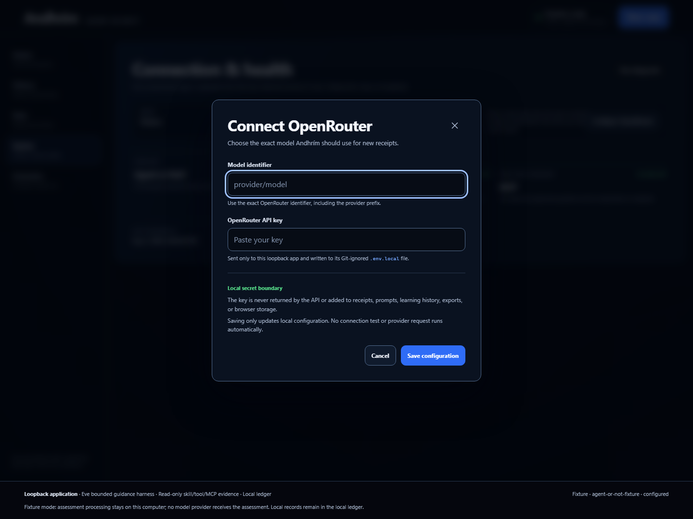

# Windows setup

Andhrím is verified on Windows 11 with Node.js 24.17, pnpm 11.18, Python 3.13, uv 0.11, and Playwright 1.62. The Node and Python lockfiles are committed.

## Install

```powershell
corepack enable
corepack prepare pnpm@11.18.0 --activate
pnpm install --frozen-lockfile
uv sync --project mcp_server --frozen
pnpm build
pnpm start
```

The launcher starts Next.js, Eve, and the read-only MCP companion on loopback. Open `http://127.0.0.1:3000`; stop all three services with Ctrl+C.

## Fixture mode

Fixture mode is the safe default. If `.env.local` is absent, `pnpm start` continues without it and makes no model-provider request. The generated receipts are deterministic test fixtures, not claims about real model quality.

## Connect OpenRouter

1. Start the app and open **System**.
2. Select **Configure OpenRouter**.
3. Enter the exact OpenRouter `provider/model` identifier and your key.
4. Optionally run **Test connection**. This sends the key only to OpenRouter’s current-key and model-metadata endpoints. It sends no assessment and requests no inference.
5. Stop the launcher with Ctrl+C, then run `pnpm start` again.
6. Run the System diagnostic and confirm that OpenRouter is active before generating a receipt.



The configuration is written to Git-ignored `.env.local`. Select **Remove saved key** in the same dialog and restart to return to fixture mode. This prototype does not provide an encrypted credential vault.

## Verification

Install the matching Playwright browser once:

```powershell
pnpm exec playwright install chromium
pnpm verify:release
```

`verify:release` runs the complete provider-free qualification and writes a machine-readable report to ignored `output/release-verification.json`. It does not authorize a live OpenRouter inference call.

## Troubleshooting

- **Eve or MCP is unavailable:** stop all launchers, run `uv sync --project mcp_server --frozen`, rebuild, then restart with `pnpm start`.
- **Saved model is not active:** restart the complete launcher; saving `.env.local` cannot change an already-running Eve process.
- **Model unavailable:** copy the exact identifier from OpenRouter’s model catalogue. Codex model names are not automatically OpenRouter identifiers.
- **Ledger integrity warning:** download the untouched NDJSON recovery file before attempting manual repair.
- **Port mismatch:** rebuild and use `pnpm start`; the launcher follows the Eve port baked into the Next.js proxy manifest.
